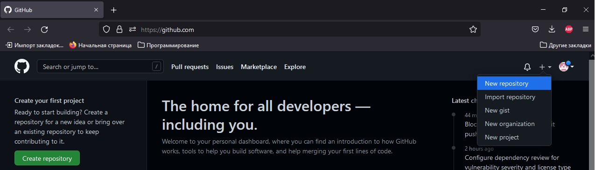
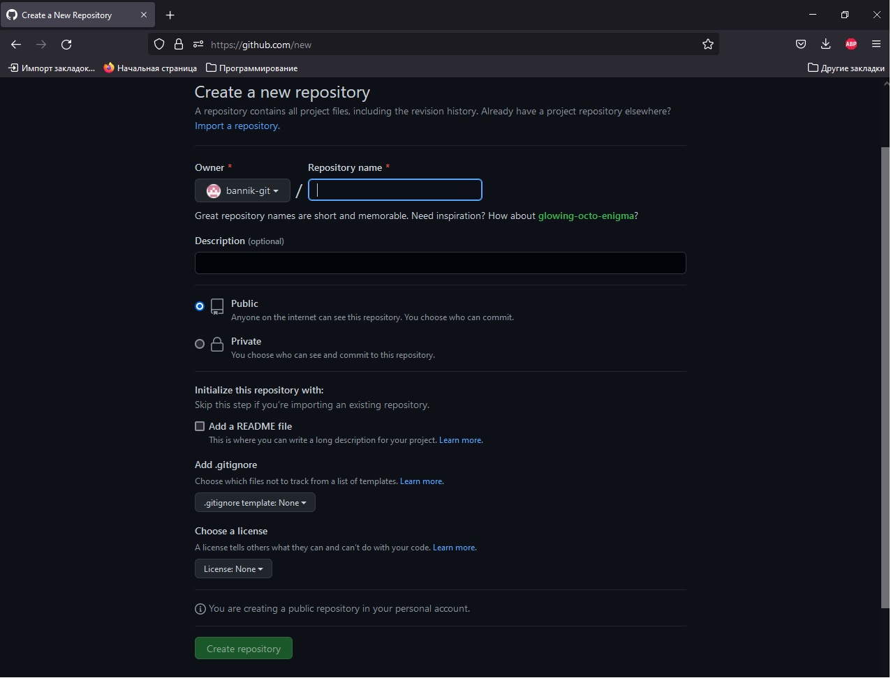

# **Инструкция по работе с git**
## **Создание и базовая работа с локальным репозиторием**
Что такое репозиторий и инструкция по созданию локальных репозиториев.  
>Репозиторий Git — это виртуальное хранилище проекта. В нем можно хранить версии кода для доступа по мере необходимости.

Для создания нового репозитория используется команда **git init**. Команду git init выполняют только один раз для первоначальной настройки нового репозитория. Выполнение команды приведет к созданию нового подкаталога .git в вашем рабочем каталоге. Кроме того, будет создана новая главная ветка.

##  **Основные команды Git**
* ***git init*** – инициализация локального репозитория
* ***git status*** – получить информацию от git о его текущем состоянии
* ***git add*** – добавить файл или файлы к следующему коммиту
* ***git commit*** -m “message” – создание коммита
* ***git log*** – вывод на экран истории всех коммитов с их хеш-кодами
* ***git checkout*** – переход от одного коммита к другому
* ***git checkout master*** – вернуться к актуальному состоянию и продолжить работу
* ***git diff*** – увидеть разницу между текущим файлом и закоммиченным файлом/
* ***git clean*** - команда git clean используется для удаления мусора из рабочего каталога. Это могут быть результаты сборки проекта или файлы конфликтов слияний.
 
 ## **Работа с ветками**
 * ***git branch*** имя_новой_ветки - создание новой ветки
 * ***git branch*** имя_ветки -m "новое_имя_ветки" - переименование веток
 * ***git branch*** -d имя_удаляемой_ветки - удаление веток
 * ***git branch*** -просмотр созданных веток  

   Пример вывода данной команды:
```
* branch_work  
  commands_git  
  history_reference  
  master
  ```
  В данном случае "*" отмечена ветка в которой мы находимся.
  * ***git checkout*** имя_ветки - переходы между ветками.  
Переходы между ветками осуществляются аналогично переходам между коммитами, с той лишь разницей, что вместо первых символов коммита прописывается имя ветки, в которую мы хотим попасть.
* ***git merge*** имя_ветки - слияние веток.  
Данная команда производит перенос данных из одной ветки в другу.  
**Важно**: *Команда перенесет данные из указанной ветки в ветку из которой эта команда запущена.*

**Конфликты при слиянии** 
Конфликт возникает, когда в двух ветках была изменена одна и та же строка в файле или когда некий файл удален в одной ветке и отредактирован в другой. Как правило, конфликты возникают при работе в команде.  
В данном случае нужно будет определить как правильно отредактировать файл самостоятельно.


## **Создание удаленных репозиториев**
Воспользуемся  крупнейшим веб-сервисом для хостинга IT-проектов и их совместной разработки - Github.com.  
Для начала работы необходимо создать аккаунт, или воспользоваться уже имеющимся.
1. На сайте [Github.com](https://github.com/) на странице своего аккаунта нажимаем на "+" в правом-верхнем углу. Выбираем "New repository".  
  
2. Заполняем обязательное поле "Repository name" и нажимаем "Create repository".  

3. Создаем локальный репозиторий и делаем как минимум один коммит.
4. Воспользуемся набором команд для отправки документов из локального репозитория в удаленный:
```
git remote add origin url
git branch -M main
git push -u origin main
```
###### при первом использовании команды "push" потребуется пройти авторизацию на github.

### Разберем команды подробнее:

`git remout add origin url` - связывает локальный репозиторий и удаленный. На место url подставляется ссылка полученная на сайте Github.com.

`git branch -M main` - указывает какую ветку локального репозитория считать основной.

`git push -u origin main` - направляет данные в удаленный репозиторий.

5. После проделанных выше действий достаточно будет команды `git push` для отправки данных в репозиторий.
##  Скачивание данных с удаленного репозитория.

1. На сайте [Github.com](https://github.com/), выбираем интресующий нас проект и делаем его Fork.
###### Fork - перетаскивание репозитория с чужого аккаунта на свой.
2. Выполняем команду
```
git clone url_репозитория
```
Данная команда создает локальный клон удаленного репозитория.  
В случае если нам нужно только получить последную версию удаленного репозитория необходимо выполнить команду

```
git pull
```
Данная команда скачивает данные с выбранного репозитория.


**Важно**: 

Команда `git pull` является составной командой и выполяет 2 действия.
1. Выкачивает файлы с репозитория.
2. Объединяет (merge) скачиваемые файламы с файлами локального репозитория.

## Внесение изменений в чужой проект.

Если мы хотим предложить изменения в чужом проекте:
1. Создаем локальную копию удаленного репозитория
2. Создаем новую ветку в локальной копии
3. В свой аккаунт заливаем внесенные изменения, команда `git push`
4. На сайте Github.com в Вашем аккаунте появляется кнопка  отправить изменения автору проекта - `Compare & pull request`  
Автор проекта получит предложенные Вами изменения, после чего примет решение о необходимости добавления изменений в свой проект.


# Полезные ссылки
1. [Полная инструкция по git на русском языке](https://www.atlassian.com/ru/git/tutorials)
2. [Инструкция по использованию языка разметки Markdown](https://doka.guide/tools/markdown/)
