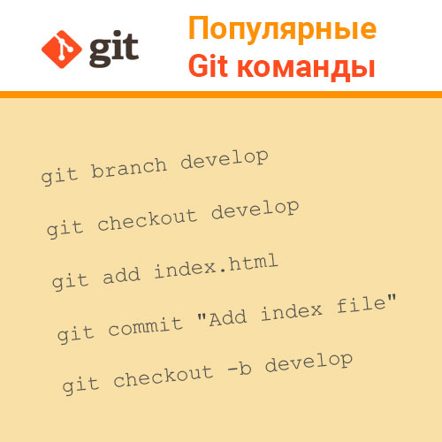

# **Инструкция по работе с git**
## **Создание и базовая работа с локальным репозиторием**
Что такое репозиторий и инструкция по созданию локальных репозиториев.  
>Репозиторий Git — это виртуальное хранилище проекта. В нем можно хранить версии кода для доступа по мере необходимости.

Для создания нового репозитория используется команда **git init**. Команду git init выполняют только один раз для первоначальной настройки нового репозитория. Выполнение команды приведет к созданию нового подкаталога .git в вашем рабочем каталоге. Кроме того, будет создана новая главная ветка.

##  **Основные команды Git**
* ***git init*** – инициализация локального репозитория
* ***git status*** – получить информацию от git о его текущем состоянии
* ***git add*** – добавить файл или файлы к следующему коммиту
* ***git commit*** -m “message” – создание коммита
* ***git log*** – вывод на экран истории всех коммитов с их хеш-кодами
* ***git checkout*** – переход от одного коммита к другому
* ***git checkout master*** – вернуться к актуальному состоянию и продолжить работу
* ***git diff*** – увидеть разницу между текущим файлом и закоммиченным файлом/
* ***git clean*** - команда git clean используется для удаления мусора из рабочего каталога. Это могут быть результаты сборки проекта или файлы конфликтов слияний.
 
 ## **Работа с ветками**
 * ***git branch*** имя_новой_ветки - создание новой ветки
 * ***git branch*** имя_ветки -m "новое_имя_ветки" - переименование веток
 * ***git branch*** -d имя_удаляемой_ветки - удаление веток
 * ***git branch*** -просмотр созданных веток  

   Пример вывода данной команды:
```
* branch_work  
  commands_git  
  history_reference  
  master
  ```
  В данном случае "*" отмечена ветка в которой мы находимся.
  * ***git checkout*** имя_ветки - переходы между ветками.  
Переходы между ветками осуществляются аналогично переходам между коммитами, с той лишь разницей, что вместо первых символов коммита прописывается имя ветки, в которую мы хотим попасть.
* ***git merge*** имя_ветки - слияние веток.  
**Конфликты при слиянии** 
Конфликт возникает, когда в двух ветках была изменена одна и та же строка в файле или когда некий файл удален в одной ветке и отредактирован в другой. Как правило, конфликты возникают при работе в команде.  
В данном случае нужно будет определить как правильно отредактировать файл самостоятельно.



# Полезные ссылки
1. [Полная инструкция по git на русском языке](https://www.atlassian.com/ru/git/tutorials)
2. [Инструкция по использованию языка разметки Markdown](https://doka.guide/tools/markdown/)
